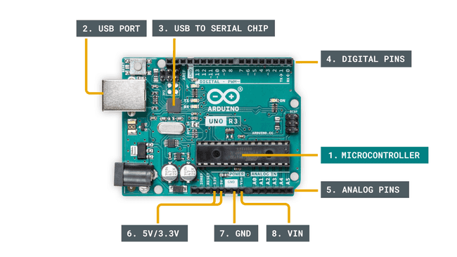

# Getting Started
## Anatomy of an Arduino Board
Although Arduino boards come in various models, most share several essential components. Here’s a breakdown of the main parts you’ll typically find:

/// caption
Arduino Board Anatomy - Public Domain([Link to image](https://docs.arduino.cc/static/d0c28c5bd0894792476c6052dea5fa63/29114/board-anatomy.png))
///

1. **Microcontroller** – Acts as the central processor, running the code you upload. It’s like a compact computer dedicated to specific tasks.
2. **USB Port** – Allows you to connect the Arduino to your computer.
3. **USB to Serial Converter** – Facilitates communication between your computer and the microcontroller, enabling you to upload programs.
4. **Digital Pins** – Used for digital signals (either HIGH/LOW or 1/0), suitable for controlling devices like LEDs or reading switches.
5. **Analog Pins** – Capable of reading analog inputs with a 10-bit resolution (values from 0 to 1023).
6. **5V / 3.3V Pins** – Provide power to external modules or sensors.
7. **GND (Ground)** – Serves as the reference point for the circuit, completing the electrical path at zero volts.
8. **VIN (Voltage In)** – Used to supply power to the board from an external source.

While different Arduino models may include additional features, these components are commonly present on most boards.
## Arduino IDE

The Arduino IDE (*Integrated Development Environment*) is the official software for writing and uploading code to Arduino boards.

### Features

- Simple text editor for writing code.
- Built-in serial monitor for communication.
- Easy upload of sketches to the board.

!!! note
    The IDE supports multiple boards and libraries.

### Installing the IDE

Download the Arduino IDE from the [official website](https://www.arduino.cc/en/software) and follow the installation instructions for your operating system.

### Writing and Uploading Code

Write your code in the editor and click the **Upload** button to send it to your Arduino board.

!!! note
    Make sure the correct board and port are selected before uploading.

***

## Connecting Arduino

To connect your Arduino board to your computer, use a USB cable. The USB connection provides both power and data transfer.

* Make sure your board is properly seated and the cable is securely connected.
* The Arduino IDE will automatically detect the board if drivers are installed.

!!! note
    If your board is not detected, check the cable and try a different USB port.

Once connected, you can upload sketches (programs) to the board using the Arduino IDE.

### Selecting the Board and Port

In the Arduino IDE, go to **Tools > Board** and select your Arduino model (e.g., Arduino Uno). Then go to **Tools > Port** and select the correct COM port.

!!! note
    The COM port may change if you unplug and replug the board.

### Troubleshooting

If you encounter issues:

- Ensure drivers are installed.
- Try restarting the IDE.
- Use a different USB cable or port.

***